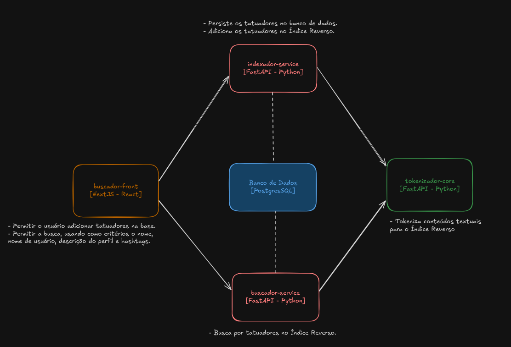

# poc-indexacao-reversa

> Prova de Conceito (PoC) para a busca com Indexação Reversa

## Visão Geral da Aplicação



## Docker 

- Primeiro, criamos uma rede para os containers:

```bash
docker network create rabisko_network
```

- Depois, vamos iniciar o banco de dados:

```bash
# postgres
cd ./database
docker build -t rabisko-database .
docker run -p 5432:5432 --network=rabisko_network --name=rabisko-database rabisko-database
```

- Logo em seguida, podemos iniciar o `tokenizador-core`:

```bash
# tokenizador-core
cd ./tokenizador-core
docker build -t tokenizador-core .
docker run -p 8010:8010 --network=rabisko_network --name=tokenizador-core tokenizador-core
```

- Com os serviços base em pé, podemos iniciar os dois últimos (`indexador-service` e `buscador-service`):

```bash
# indexador-service
cd ./indexador-service
docker build -t indexador-service .
docker run -p 8011:8011 --network=rabisko_network --name=indexador-service indexador-service

# busca-service
cd ./busca-service
docker build -t busca-service .
docker run -p 8000:8000 --network=rabisko_network --name busca-service busca-service
```

- Por fim, subimos o front pelo docker. 

```bash
cd ./front_search-tatoo/
docker build -t front-search-tatoo .
docker run -p 3000:3000 --network=rabisko_network --name front-search-tatoo front-search-tatoo
```